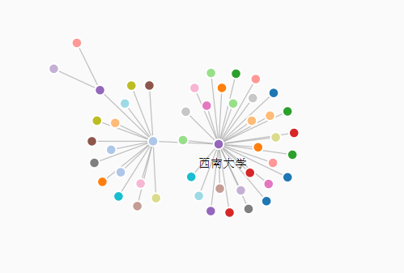
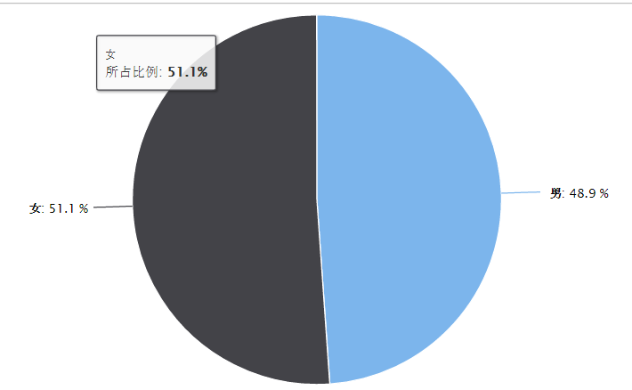
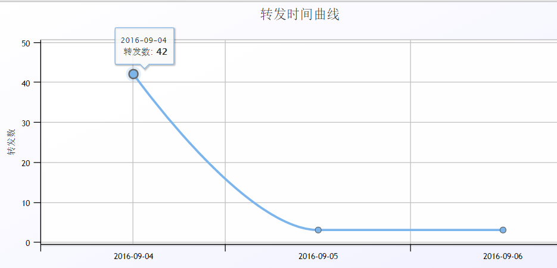

# 关于该程序

## 目的
- 分布式微博爬虫
- 抓取微博用户信息和分析热门微博信息传播扩散
- 测试微博反爬虫机制


## 目前的成果
- 微博搜索、微博信息处理、用户信息处理等解析模块完成
- 可以持续稳定的采集微博和微博用户相关数据(还在测试单机单IP的请求阈值)
- 初步完成分布式抓取功能

## TODO
- [x] 添加搜索接口，可以对某个指定话题进行搜索
- [ ] 将存储后端从Oracle转向Mysql
- [ ] 在执行单个任务(比如微博传播分析)的时候使用进度条
- [ ] 可视化展示某条微博具体传播信息，微博用户信息等
- [ ] 采用布隆过滤器去重网页
- [ ] 测试单机单账号访问阈值
- [ ] 测试单机多账号访问效果
- [x] 优化代码，让程序运行更加快速和稳定
- [x] 修复某些时候抓取失败的问题
- [x] 改成分布式爬虫
- [ ] 验证登录状态的cookies和代理ip（主要是异地）是否可以成功抓取
- [ ] 完善文档，包括python版本，怎么快速创建虚拟环境，然后安装相关依赖库和直接使用
dockerfile部署项目;讲解微博的反爬虫策略；讲解微博扩散信息抓取思路
- [ ] 微博评论信息抓取（用作语料）
- [ ] 配置redis主从库，预防单点故障
- [ ] 实现断点续传的功能（在repost抓取的时候，如果转发数目特别多，暂存相关信息到redis
中，以防当前worker挂了又必须重头抓取）
- [ ] 验证UA头使用百度、Google等搜索引擎的时候请求是否放宽了

## 配置和使用
- 由于高版本的celery不支持windows,所以务必在**类Unix系统**部署，如果需要在windows
上部署的话，可以把celery版本降为3.1.25: ```pip install celery==3.1.25```，这是
celery最后支持的一个windows版本
- 安装相关依赖```pip install -r requirements.txt```,cx_Oracle的安装可能会
出问题，windows平台请看[这里](http://rookiefly.cn/detail/69)，linux平台请
看[这里](http://rookiefly.cn/detail/79)

- 打开[配置文件](./config/spider.yaml)修改数据库和微博账号相关配置
- 打开[sql文件](./config/sql/spider.sql)查看并使用建表语句
- 入口文件 
 - [repost.py](./tasks/repost.py)和[repost_first.py](repost_first.py):微
 博程序
 - [search.py](./tasks/search.py):微博搜索程序
 - [login.py](./tasks/login.py)和[login_first.py](login_first.py):微博登
 陆客户端程序

- 微博登录和数据采集:采用celery来进行任务调度
 - celery的broker和backend统一采用redis，分布式部署的时候需要关闭redis的保护
 模式，或者为redis设置密码
 - 启动登录定时任务和worker节点进行登录,定时登录是为了维护cookie的时效性，据我实验，
 微博的cookie有效时长为24小时。
   - 切换到tasks目录，首先启动worker(在多个节点启动，**分散登录地点**)：```celery
   -A tasks.workers
   worker --loglevel=info --concurrency=1```
   - 第一次登陆微博的时候，为了让抓取任务能马上执行，需要切换到根目录执行```python
   login_first.py```获取首次登陆的cookie
   - 同理，第一次执行转发微博抓取，也需要执行```python repost_first.py```
   - 切换到tasks目录，再启动beat任务(beat只启动一个，否则会重复执行定时任务)：```
   celery beat -A
   tasks.workers -l info```
 - 为了保证cookie的可用性，除了做定时登录以外，另外也从redis层面将cookie过期时间设置
 为23小时，每次更新就重设过期时间


## 其它说明
- [sql表](./config/sql/spider.sql)中关于weibo_sina_users和
weibo_search_data有一些没有sql注释的列，是老项目使用API获取的，目前已无法获取，
所以可根据自身需要删除或修改
- 本项目目前默认采用单线程进行抓取，因为多线程抓取会极大增加封号的危险。可能在尝试代理IP
有效性后，会采用多线程。单线程可用分布式的方式来提高抓取速度。
- 如果是开发版，可能会存在运行出问题的情况，所以建议通过[release](https://github.com/ResolveWang/WeiboSpider/releases)页面下载稳定版

## 本项目目前的一些数据可视化展示(使用的**d3.js**)（这部分代码目前还未实现，因为之前的数据可视化是一个朋友做的）:
对[某条指定微博](http://weibo.com/1973665271/E6HiqDiCg?refer_flag=1001030103_&type=comment#_rnd1473216182746)进行分析

微博扩散情况



转发该微博的用户性别比例



转发该微博的时间



转发该微博的地域分析


